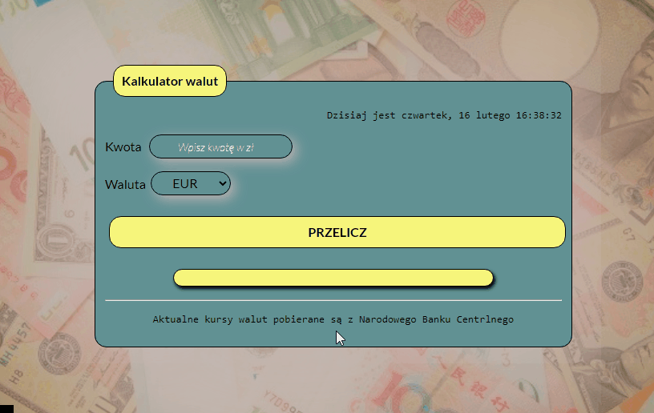

# Currency Converter

# Demo website: [open in a new tab](https://gosia-magdzik.github.io/kantor-react/){:target="_blank"}

# About project

Dear all, 

This is my second project in React technology where I converted my old application written in JS. 

Project was intended to create a simple app which convert polish zloty into up-to-date exchange rates witch has been taken from European Central Bank.

*The application is working on as well as on computers as on mobile devices*

Enjoy 

## This project was bootstrapped with [Create React App](https://github.com/facebook/create-react-app).

## Available Scripts

In the project directory, you can run:

### `npm start`

Runs the app in the development mode.\
Open [http://localhost:3000](http://localhost:3000) to view it in your browser.

The page will reload when you make changes.\
You may also see any lint errors in the console.

## Technologies used

 **HTML**   **JS**          **ES6+** **CSS**

 **BEM**    **React**  **API**    **GIT**

