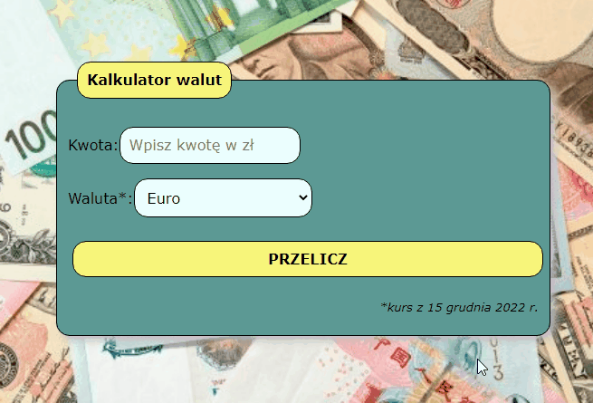

# Currency Converter

# Demo: 
[Click to see](https://gosia-magdzik.github.io/kantor-react/)

# About project

Dear all, 

This is my second project in React technology where I converted my old application written in JS. 

he project was intended to create a simple app which convert polish zloty to EUR, GBP, NOK or USD currency.

*Please notice that project isn't finished yet*

## This project was bootstrapped with [Create React App](https://github.com/facebook/create-react-app).

## Available Scripts

In the project directory, you can run:

### `npm start`

Runs the app in the development mode.\
Open [http://localhost:3000](http://localhost:3000) to view it in your browser.

The page will reload when you make changes.\
You may also see any lint errors in the console.

## Technologies used

 **HTML**

 **CSS**

 **JS** 

 **ES6+**

 **BEM**

 **React**

